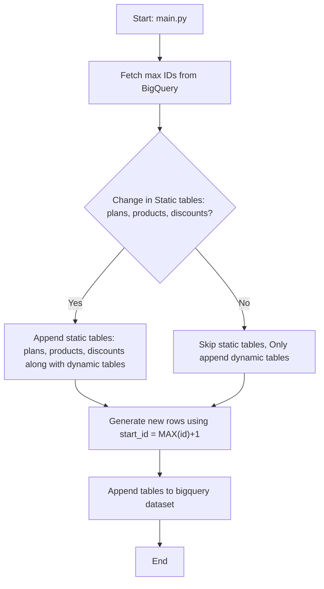

# Load Phase (Google BigQuery)

This module documents the **Load Phase** of the SaaS analytics pipeline. After generating synthetic SaaS billing data in Python (Extract Phase), the next step is to design and implement a **data pipeline that loads this data into Google BigQuery** for centralized analytics.  

**Goal:** build a reliable, repeatable, **append-only** load process that:  
- preserves historical records (no destructive updates),
- enforces schema consistency and referential integrity,
- assigns sequential IDs that continue across runs,
- cleanly separates static reference data from dynamic transactional data,
- is simple to run now and ready to schedule later.


## Project Structure

The Load Phase relies on the following key files:

- **`load_to_bq.py`**  
  Located in the `load/` folder. Responsible for connecting with the BigQuery client and defining the logic to load synthetic data into the BigQuery dataset. Also contains helper functions for tasks like fetching maximum IDs and applying write dispositions.

- **`main.py`**  
  Currently located in the `extract/` folder. Acts as the **orchestrator** of the pipeline, calling data generation functions and then invoking the load functions. This will eventually be separated more cleanly so that Extract and Load phases can run independently or together.

- **`config.py`**  
  Located in the `extract/` folder. Defines lists, dictionaries, and other configuration values (e.g., number of rows to generate, product/plan definitions) so they can be easily changed without hardcoding values in functions.

- **`schema.py`**  
  Located in the `extract/` folder. Defines schema details in Python and SQL-like format, serving as a reference for column names, data types, and constraints. A future version will also include explicit BigQuery schema definitions for better reference and validation.  

## Design Principles of the Pipeline  

### 1. Schema Handling  

One of the first design choices was how to handle **schemas** between Python-generated dataframes and BigQuery tables. We fetch the schema directly from BigQuery using:

  ```python
  client.get_table(table_id).schema
  ```  
  where table_id = {project_name}.{dataset_name}.{table_name}  

This approach means **BigQuery itself is the source of truth** for schema definitions.

#### Thought Process
- If we relied only on Python/pandas to infer schema, fields like `datetime` might be misinterpreted (e.g., I had an issue where few datetime fields were stored as integers).  
- By fetching from BigQuery, we enforce column types, nullability, and other constraints exactly as the warehouse expects them.  

#### Trade-Offs
- Requires tables to exist in BigQuery before applying schema-based validation. On the very first run, schema must be created or inferred from the dataframe.  
- Slight overhead of querying schema on every run.  

#### Why This Matters
- **Prevents schema drift**: the Python dataframe always conforms to BigQuery definitions.  
- **Ensures consistency**: nullability and data types are enforced the same way every run.  
- **Operational stability**: avoids subtle bugs where a column type mismatch could cause load jobs to fail or produce unreliable data.

This design decision makes the pipeline more **robust** and **operationally reliable**, especially as the dataset grows and more tables are added.  

> **Note:** When I began this project, I hadn’t yet chosen a warehouse. Deciding earlier would have made it easier to design the schema around warehouse principles. Since I was limited to free/demo tiers that support incremental datasets with reasonable read/write and storage options, I selected **BigQuery**. Snowflake’s free tier had constraints (and my trial period was nearly over), which made it less suitable.  

---  

### 2. Static vs Dynamic Tables

In the pipeline, tables are divided into **static reference data** and **dynamic transactional data**:

- **Static tables**: `plans`, `products`, `discounts`  
  - Rarely change.  
  - On each run, the pipeline checks if new entities have been added.  
    - If **changes exist** → load with `WRITE_APPEND`.  
    - If **no changes** → skip the load.  
  - Old rows remain intact while new ones are appended.  
  - This behavior mirrors **Slowly Changing Dimensions (SCD Type 2)**, where historical versions are preserved instead of being overwritten (Type 1).  

- **Dynamic tables**: `customers`, `subscriptions`, `invoices`, `payments`, `line_items`, `subscription_discounts`  
  - Grow continuously.  
  - Always loaded with `WRITE_APPEND`.  
  - Historical rows remain intact, and each run only appends new data.  

### Why This Matters  
- **`WRITE_APPEND`** ensures both static and dynamic data maintain historical continuity.  
- This design reflects real-world SaaS pipelines where static entities (like product catalogs or pricing plans) evolve slowly, while transactional data grows rapidly and must always be preserved.
where static entities evolve slowly (like a product catalog) while transactional data grows rapidly.  

### 3. Sequential ID Continuity (Surrogate Keys)

#### Problem
Each entity in the pipeline (customers, subscriptions, invoices, payments, etc.) needs a **stable, unique identifier** to act as its primary key and to maintain relationships across tables.  
In synthetic data generation that I have applied, functions start fresh on every run and can easily re-use the same IDs, which would create duplicates and break referential integrity.

#### Solution
To address this, the pipeline uses **surrogate keys** - system-generated IDs with no business meaning that serve purely as stable identifiers.  
Before generating new rows, the pipeline queries BigQuery for the current maximum ID:  

```sql
SELECT COALESCE(MAX(id), 0) FROM dataset.table
```  
New rows then continue from `MAX(id) + 1`.  
This ensures IDs remain sequential and unique across runs.  

#### Why Surrogate Keys
- **Stable** → unaffected by business attribute changes (e.g., customer email updates).  
- **Reliable** → guarantees referential integrity across multiple tables.  
- **Scalable** → supports incremental, append-only growth over time.  

#### Alternatives Considered
- Hashing techniques  
- BigQuery `FARM_FINGERPRINT`  
- UUIDs  

These were less suitable for this use case: they either introduced collisions in small synthetic datasets, lacked sequential ordering, or complicated joins.  

#### Outcome
The surrogate key approach provides a **reliable, production-style solution** for unique identifiers. Even with the slight overhead of querying BigQuery for `MAX(id)`, this method ensures the pipeline always generates clean, incremental keys.  

### 4. Execution Flow  

The pipeline is orchestrated through `main.py`, handling **static** and **dynamic** tables differently.  


#### Pipeline Guarantees
- **Idempotent behavior** → running the same load twice will not corrupt data.  
- **Referential integrity** → all relationships between tables remain valid.  
- **Incremental growth** → each run expands the dataset without rewriting history.  
- **Scalability** → approach is designed to handle ongoing weekly growth.  


### 5. Current Setup Example

The current BigQuery dataset contains the following tables:

| Table Name              | Type          | Current Size | Growth Pattern              |
|--------------------------|---------------|--------------|-----------------------------|
| customers               | Dynamic       | 15 rows      | +5 rows per weekly run      |
| subscriptions           | Dynamic       | ~15–20 rows  | Scales with customers       |
| invoices                | Dynamic       | ~15–20 rows  | Scales with subscriptions   |
| payments                | Dynamic       | ~15–20 rows  | Scales with invoices        |
| line_items              | Dynamic       | ~15–20 rows  | Scales with invoices        |
| subscription_discounts  | Dynamic       | ~7–10 rows   | ~50% of subscriptions       |
| products                | Static        | 3 rows       | Config-defined              |
| plans                   | Static        | 9 rows       | Config-defined              |
| discounts               | Static        | 3 rows       | Config-defined              |  

This foundation will power the next phases:
- **dbt models** to define metrics like MRR and ARR.  
- **BI dashboards** (Power BI, Looker, or Sigma) to visualize revenue trends.  
- **Scheduled runs using airflow or other scheduler** to simulate continuous SaaS operations.  

---

### 6. Closing Note

This project currently covers the **Extract** (synthetic data generation) and **Load** (BigQuery pipeline) phases of the ELT lifecycle.  
The next milestones are to implement the **Transform** phase with dbt (defining SaaS revenue metrics such as MRR, ARR, and churn) and to build **interactive dashboards** in Power BI / Looker / Sigma for real-time analytics.  

By combining data generation, a reliable append-only pipeline, warehouse modeling, and BI visualization, the goal is to simulate the full lifecycle of a SaaS analytics platform — from raw events to business-ready insights.


